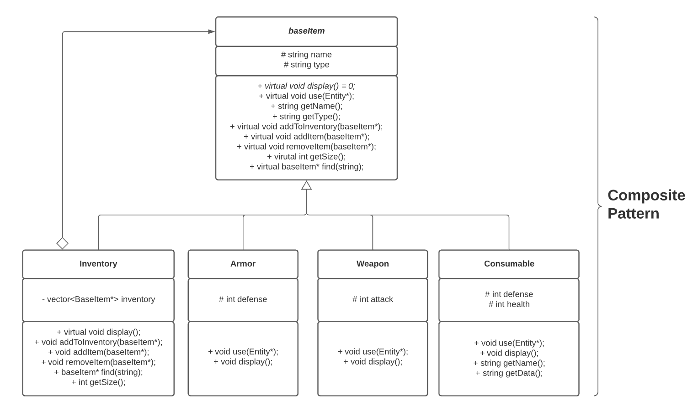

# A Text Adventure Game
 
 Authors: [Benjamin Denzler](https://github.com/ben-denzler), [Ashley Pang](https://github.com/apang024), [Joshua Beed](https://github.com/jbeed33)
 
## Project Description
 
 This is a simple text-based RPG that has a story, choice of characters, inventory for armor/weapons/items, turn-based combat and several endings that depend on choices you make during the game. The game takes place in "steps" that can be narrative or combat. Dialogue choices are made while not in combat, and battles have options to attack, run etc.

 We were interested in this project because we grew up playing video games (at least to some extent) and thought that trying to make one ourselves would be a fun and exciting project. A role-playing game is fairly open-ended compared to other ideas, and so allows us to be more creative- we can write our own story! A more open-ended project like this will also help us better understand the need for design patterns to structure our program.

 ### Languages, tools and technologies being used
 * [C++](https://en.wikipedia.org/wiki/C%2B%2B) - Our choice of coding language for the project
 * [CMake](https://cmake.org/) - Makefile tool used for easy project compilation
 * [Valgrind](https://valgrind.org/) - Memory management and error detection tool
 * [Git](https://git-scm.com/) and [GitHub](https://github.com/) - Version control and project management tools
 * [Visual Studio Code](https://code.visualstudio.com/) - Robust code editor with an integrated terminal and Git support
 * [LucidChart](https://www.lucidchart.com/) - Tool for creating OMT class diagrams

 ### Project input/output
 * **Input:** User enters numbers corresponding to choices they can make during dialogue and combat scenes. For example, when not in combat, user could choose to travel down path 1 or 2, or could access their inventory before deciding. Invalid input is ignored.
 * **Output:** The game primarily outputs sentences describing the situation to the user and prompts them to make choices until they reach the end of the game. There are no graphical elements for the environment etc., only text. Outputs are continually displayed until the user gives input.

 ### Design patterns to be used
 * **Composite:** 
    * We're using the Composite design pattern primarily for the game's inventory system. We'd like to give the character different inventories (armor, weapons, items etc.), and we want to have a unified interface for interacting with both inventories and their items- a virtual `use()` function. Its functionality should be dynamic: using an inventory would open it, while using items would equip or consume them. We could implement this with arrays that store items, but it would quickly become complicated. Lots of inventories and items would require lots of arrays being stored in the character class, and hardcoding arrays like this prevents us from easily adding or removing them throughout the game. Additionally, we would have to manually ensure all our classes have matching `use()` functions for our interface, creating more room for error. 

    * The Composite design pattern fixes these problems by allowing us to define an Inventory object as a composite that can contain items *or* other inventories. Both items and inventories can be derived from a shared base class that defines a `use()` interface. This way, we can simply give our character class a single Inventory object and add other inventories to it as needed, and every inventory and item object will support a `use()` function like we wanted. This approach both simplifies the structure of our character class and allows us to dynamically add and remove inventories throughout the game (if you get a new backpack, for example). Additionally, since all items and inventories inherit from a base class, our shared interface will always be consistent, eliminating the need to manually maintain this.

* **Abstract Factory:**
    * The Abstract Factory design pattern is being used for character and enemy creation. The player should be able to choose from a number of pre-created characters when they start the game, and enemy encounters should randomly select from one of several enemies to fight. This requires each Character and Enemy object to be uniquely constructed at runtime. Without a design pattern for this, our `main()` would either need many branches to decide which objects to create, our we would use complex constructors for each object. Both approaches are difficult to maintain and implement at large scale.

    * The Abstract Factory design pattern fixes these problems by letting dedicated Factory classes handle object creation for us. We can predefine different instances of characters and enemies, then pass a string to our Factory class to create one. For example, if the player chooses a Wizard, we can simply pass "Wizard" to our Factory and let it handle the details of its creation. This greatly simplifies object creation and allows for much cleaner code that is easier to maintain. The use of an Abstract Factory in particular also allows us to easily create other Factories for different classes, improving the extensibility of our program.

## Class Diagram
### Full OMT diagram:

 

 This is the full OMT diagram for our program, showing our Composite and Abstract Factory design patterns in addition to our GameController class. In this full diagram, you can see that the client interacts with the program through GameController, BaseItem and AbstractFactory. More details on these components is below.

### Composite pattern diagram:

  

This diagram describes the Composite design pattern that we are using for the game's inventory system. BaseItem is a Component that defines the shared interface for all our inventory classes. `use()` will open an inventory, equip armor and weapons, or use a consumable. `getName()` returns an object's name, and `display()` outputs an item or inventory's stats. Inventory is a Composite because it implements the shared interface but also contains other BaseItem objects (acts as a bag that contains other items). Armor, Weapon and Consumable are all Leaves and will be held within Inventory objects. The leaves implement their own stats like defense, attack or health. Each Character object will get their own private Inventory which can be added to throughout the game.

### Abstract Factory pattern diagram:

  

 This diagram describes the Abstract Factory design pattern being used for character and enemy creation. We've defined an abstract class, AbstractFactory, that other Factories derive from. Our game only needs to create Enemies and Characters, so we have a single EntityFactory. Enemy and Character derive from a virtual Entity class which defines shared functions and data members. The factory's `createEnemy()` and `createCharacter()` will take strings as parameters to decide what type of object to create. When created, an enemy's name and stats will be randomized, and a character will be given an inventory and stats appropriate for the chosen class, in addition to a player-specified name. All entities have a name, health, attack and defense as well as functions for combat and displaying these values. Since factories derive from an abstract class, we could easily add more factories in the future if we expand the game.

 ### GameController diagram:

 

 The final part of our OMT diagram is a single class rather than a design pattern. This GameController class will hold information about the game's current state and direct its flow through use of classes from the other two design patterns. In this way, it is essentially the interface for the game. It keeps track of the enemies that *could* be encountered, the player's character and the current enemy. It can create entities by calling our Factory, and it is responsible for reading and outputting the game's narrative from a file. It will dictate much of the game's user interface and decide when dialogue, battle etc. should occur based on headings we place in our game's "script" file.
 
 > ## Phase III
 > You will need to schedule a check-in with the TA (during lab hours or office hours). Your entire team must be present. 
 > * Before the meeting you should perform a sprint plan like you did in Phase II
 > * In the meeting with your TA you will discuss: 
 >   - How effective your last sprint was (each member should talk about what they did)
 >   - Any tasks that did not get completed last sprint, and how you took them into consideration for this sprint
 >   - Any bugs you've identified and created issues for during the sprint. Do you plan on fixing them in the next sprint or are they lower priority?
 >   - What tasks you are planning for this next sprint.

 > ## Final deliverable
 > All group members will give a demo to the TA during lab time. The TA will check the demo and the project GitHub repository and ask a few questions to all the team members. 
 > Before the demo, you should do the following:
 > * Complete the sections below (i.e. Screenshots, Installation/Usage, Testing)
 > * Plan one more sprint (that you will not necessarily complete before the end of the quarter). Your In-progress and In-testing columns should be empty (you are not doing more work currently) but your TODO column should have a full sprint plan in it as you have done before. This should include any known bugs (there should be some) or new features you would like to add. These should appear as issues/cards on your Kanban board. 
 
 ## Screenshots
 > Screenshots of the input/output after running your application
 ## Installation/Usage
 > Instructions on installing and running your application
 ## Testing
 > How was your project tested/validated? If you used CI, you should have a "build passing" badge in this README.
 
